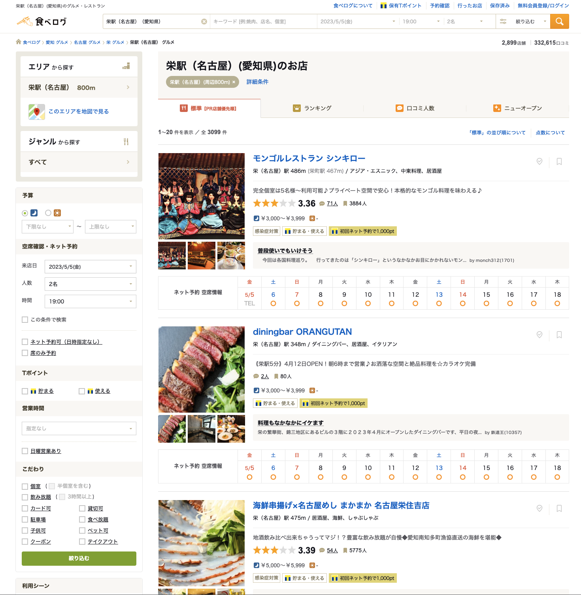
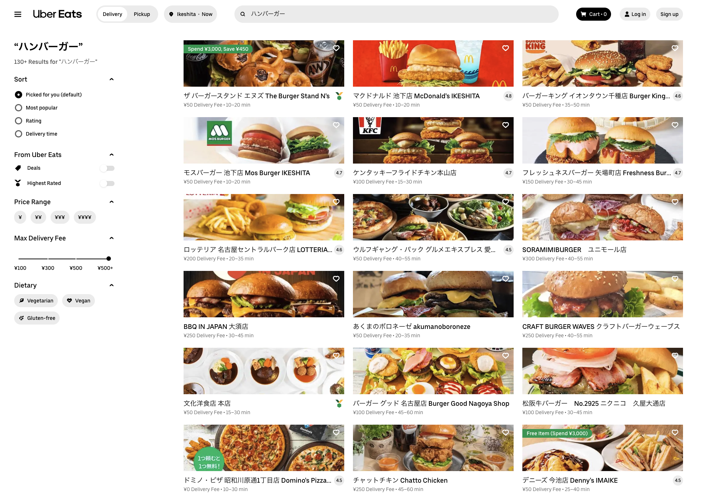
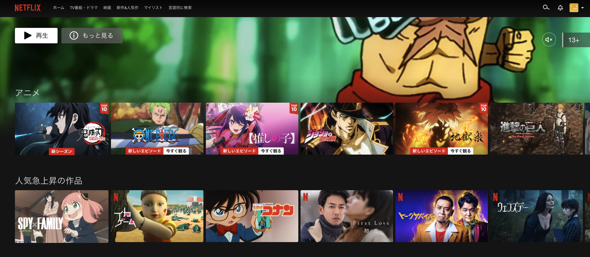
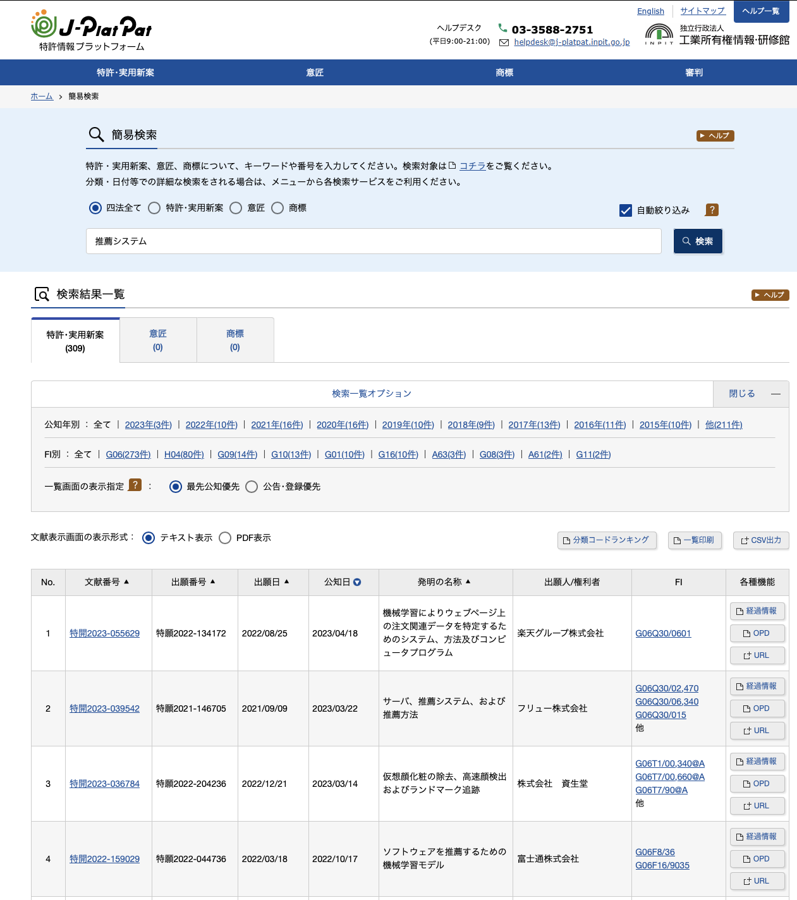

# 3章　推薦システムのUI/UX

推薦システムが「意思決定を支援するシステム」として機能するために提供すべきUI/UXについて紹介します。

## 3.1　UI/UXの重要性
推薦システムに関する書籍や論文は、アルゴリズムに関するものが多く、特に機械学習や深層学習の応用に注目が集まっています。
しかし、UI/UXについての情報は少なく、実際のサービス開発や運用の経験がなければその重要性に気づくことは難しいです。
本書では、アルゴリズムに加えてUI/UXについても詳しく解説しています。

推薦システムを実際のサービスに導入する際、高度な推薦アルゴリズムを用いても、適切なUI/UXが提供されなければユーザーの意思決定を支援することができず、推薦システムとして不十分な状態となります。
本章では、サービス利用者と提供者の目的を分類し、それぞれに適切なUI/UXを提供する方法を実在するサービスの例を挙げながら詳しく解説しています。

## 3.2　サービスを利用するユーザーの目的に応じたUI/UX事例

推薦システムを活用したサービスの利用者側であるユーザーの目的ごとのUI/UXの具体事例を紹介します。
ユーザーの目的は利用するサービスの性質やそのドメインなどによって多岐にわたりますが、ここでは、J. Herlocker†1を参考に次の4つの分類に従って説明します。

[J. Herlocker Evaluating collaborative filtering recommender systems](https://grouplens.org/site-content/uploads/evaluating-TOIS-20041.pdf)

|ユーザの目的	|内容|	
|---|---|
|適合アイテム発見（find good items）	|ユーザーにとって最も適した1つのアイテムを効率的に見つけることを目指す推薦システムの手法です。	|
|適合アイテム列挙（find all good items）	|ユーザーが目的を達成するために適したアイテムをできるだけすべて見つけることを目指す推薦システムの手法です。|
|アイテム系列消費	|連続した推薦アイテムによりユーザ体験を向上させることを目指す推薦システムの手法です|	
|サービス内回遊	（Just Browsing）と|アイテムの閲覧が目的の回遊に対応する	|

### 3.2.1　適合アイテム発見

適合アイテム発見とは、ユーザーが自分の目的を達成するために適したアイテムを１つでも見つけることを指し、例えば飲食店を探す場合は、ユーザーの好みに適合した飲食店を効率的に発見することが求められます。
リスト形式でアイテムを提示する場合、1つの画面に表示できる情報量に限りがあるため、必要な情報を適切に取捨選択することが重要です。
また、複数の異なるアルゴリズムでアイテムを整列した複数のリストを提供することで、ユーザーが適合アイテムと出会える可能性を高めることができます。
最近では、アイテムを横向きに並べて複数のリストを1つの画面に表示するサービスも増えており、操作性の良さとともに、明確なフィードバックを得やすいという特徴を持ちます。

|サービス名|特徴|
|---|---|
|食べログ|アイテムをリスト形式で表示し、画像などの少ない情報で魅力が伝わるアイテムが適している。複数の切り口でアイテムを推薦し、画面上側にタブを配置することで複数のリストを切り替えて閲覧できるようにしている。|
|Uber Eats|アイテムをリスト形式で表示し、配達先がユーザーの家であることが前提のため、料理の写真を前面に出している。店内の写真はなく、配達エリアや料理ジャンルでアイテムを絞り込む機能がある。|
|Netflix|アイテムを横向きに並べることで複数のリストを1つの画面に表示し、1枚の画像と短いテキストなどの少ない情報で魅力が伝わるアイテムが適している。異なるアルゴリズムで並び替えられた複数のリストを提供することで、ユーザーが適合アイテムと出会える可能性を高めている。|
|Tinder(マッチングアプリ）|アイテムを左右にスライドすることで、気に入ったか否かをユーザーに即座にフィードバックさせる形式を採用しており、集めにくいネガティブなフィードバックも多く集めることができる。たくさんの候補を閲覧する必要があるため、ユーザー1人あたりのアイテムの閲覧数が大きくなり、自分にとっての適合アイテムを探すことができる。誤操作に備えて、フィードバックの訂正機能を提供している。![tinder://tinder.com）(https://www.youtube.com/watch?v=NJMXik1YOvw&t=101s)
<iframe width="560" height="315" src="https://www.youtube.com/embed/NJMXik1YOvw?start=117" title="YouTube video player" frameborder="0" allow="accelerometer; autoplay; clipboard-write; encrypted-media; gyroscope; picture-in-picture; web-share" allowfullscreen></iframe>|

### 3.2.2　適合アイテム列挙

適合アイテム列挙は、ユーザーが目的達成に適したアイテムをできるだけすべて見つけようとする状況を指します。
例として、賃貸物件の検討や特許調査が挙げられます。この場合、ユーザーはできるだけ多くの適合アイテムを閲覧したいと考え、漏れがあってはならないため、ユーザーの嗜好を明確に示す必要があります。特に、特許のようなすべての適合アイテムを発見する必要があるものは、検索システムに分類されることもあります。

適合アイテム列挙では、一覧性のある表示形式が一般的で、ユーザーが情報を閲覧しやすいように並べ替えが求められます。
アイテム数が表示できるようにし、ユーザーが条件を調整できるようにすることが重要です。また、条件に合わないが目的を達成できるアイテムを表示することも有効です。
ユーザーが条件を保存できるようにし、新しい一致アイテムが現れたら通知することが効果的です。
しかし、同じアイテムを扱うサービスでも、ユーザーの目的が異なる場合は提供すべきUI/UXも異なります。

#### 賃貸物件サイトでの適合アイテム列挙の観点

- ユーザーが目的に応じて適切な検索条件を設定できるようにする。
- 一覧性のある表示形式を用いて、ユーザーが多数のアイテムを効率的に閲覧できるようにする。
- 適合アイテムの件数が明確で、ユーザーが検索条件を調整しやすい環境を提供する。
- ユーザーの検索条件に近い、目的を達成できるアイテムも提示することを検討する。

#### 特許検索サイトでの適合アイテム列挙の観点

- ユーザーが目的に応じて適切な検索条件を設定できるようにする。
- 一覧性のある表示形式を用いて、ユーザーが多数のアイテムを効率的に閲覧できるようにする。
- 適合アイテムの件数が明確で、ユーザーが検索条件を調整しやすい環境を提供する。
- 漏れのない検索結果を提供することが重要であり、間違ったものが推薦されることが許容される場合がある。

### 3.2.3　アイテム系列消費

アイテム系列消費は、推薦されたアイテムの系列全体から価値を享受することを目的とする状況です。
例えば音楽ストリーミングサービスで連続して適切な音楽を提供することが重要で、同じアイテムの繰り返し推薦も場合によってはユーザー体験を向上させます。
ただし、推薦の頻度やタイミングを考慮し、ユーザーの探索欲求に応える未知の音楽も適切に提供することが重要です。

|特徴	|Spotify|	ECサイト|
|----|----|----|
|目的	|連続して提供されるアイテムの系列全体から価値を享受することを目的とする	|消費していく中で、次のアイテムを推薦していくことで利益を得ることを目的とする|
|アイテムの特性|	同じアイテムを何度も推薦してもユーザー体験が向上することがある	|同じアイテムばかり推薦されると満足度が低下する|
|ユーザーのニーズ	|探索欲求を持つユーザーも多く、自分がまだ知らないが好みに合うであろう音楽に出会いたいという需要がある	|すでに必要な商品を買い揃えたいという需要が強い|
|適切なコントロール|	好みの音楽と、未知の音楽の割合を適切にコントロールする必要がある	|同じアイテムを連続して推薦する頻度やタイミングを適切にコントロールする必要がある|

### 3.2.4　サービス内回遊

サービス内回遊は、ユーザーがサービスの本来の目的ではなく、アイテム閲覧を目的として利用する場合です。
購入意思が低いユーザーに対して過度な推薦は避け、人気アイテムや新着アイテムを提示することで、ユーザー満足度を向上させることが重要です。

Airbnbのようなサービスでは、人気観光地や特定のテーマに沿ったアイテムを表示することで、ユーザーの探索的回遊を促し満足度を向上させる。
将来的に購買ニーズが高まると、利用が期待され、回遊時のデータを使い精度の高い推薦が可能になります。

## 3.3　サービスの提供者の目的に応じたUI/UX事例

先ほどはシステムを利用するユーザーの目的に注目した分類を行いましたが、次はサービスを提供する側の目的に注目します。ここではBen Schafer†[E-Commerce Recommendation Applications](https://www.researchgate.net/publication/2401786_Beyond_Algorithms_An_HCI_Perspective_on_Recommender_Systems)やSwearingen†3を参考に、推薦システムを活用するサービスの提供者側の代表的なビジネス目的を以下の5つに分類しました。

|ビジネス目的||
|---|---|
|新規・低利用頻度ユーザーの定着|サービスの価値を理解させ、利用継続や頻度の向上を促すことです。|
| サービスへの信頼性向上|ユーザーが安心して利用できる環境を提供し、長期的な顧客ロイヤルティを構築することです。|
| 利用頻度向上・離脱ユーザーの復帰|ユーザーエンゲージメントを高め、サービスの価値を再認識させて長期的な利用を促すことです。|
| 同時購入（cross selling）|関連商品やサービスを提案し、ユーザーの購入範囲を拡大して売上を向上させることです。|
| 長期的なユーザーのロイヤルティ向上||

|サービス	|推薦内容|
|---|---|
|Amazon	|「Amazonベストセラー」、「Amazon今週のおすすめ本」、「Amazon新着本」などの統計情報に基づく推薦|
|Netflix	|「Top 10 in Japan Today」、「Netflixオリジナル作品」などの統計情報に基づく推薦|
|Spotify	|「Spotifyチャート」、「今週のアーティスト」、「新譜情報」などの統計情報に基づく推薦|
|Apple Music	|「アップルミュージックベストヒット」、「今週のおすすめアルバム」、「人気曲ランキング」などの統計情報に基づく推薦|
|ZARA	|「人気商品ランキング」、「新着商品」、「ZARA今週のおすすめ」などの統計情報に基づく推薦|
|Instagram	|「#tbt」、「#ootd」、「#foodporn」などの人気ハッシュタグに基づく推薦|
|Twitter	|「トレンドワード」、「ユーザーおすすめ」、「フォローした人のつぶやき」などの統計情報に基づく推薦|
### 3.3.1　新規・低利用頻度ユーザーの定着

新規ユーザーや低利用頻度ユーザーの定着は、サービス提供者にとって重要です。
概要推薦（broad recommendation)（統計情報や編集者の選択に基づく推薦）が効果的で、多くのユーザーのニーズを満たし、サービス継続利用を促すことができます。新規・低利用頻度ユーザーには、目につきやすい位置に配置し、簡単なフィルタリング機能も提供することが効果的です。
目的は、多くのユーザーに適度に響くアイテムを推薦することで、サービスから離脱せずに利用し続けてもらうことです。
Netflixの「Top 10 in Japan Today」は、その分かりやすいUIで興味を惹き、効果的な体験を提供します。

概要推薦（broad recommendation)

### 3.3.2　サービスへの信頼性向上

|サービス	|取り組み|
|----|----|
|Amazon	|日本以外からのレビューを非表示にする機能を提供することで、レビューの質を担保する。また、レビューを検閲してから公開するという仕組みを導入することで、スパムのようなレビューを防止する。|
|Netflix	|ユーザーはアカウント作成直後に好きな作品を選択するよう促し、選択後は入力された情報を用いてコンテンツをパーソナライズしていることを明示的に伝える。&br;トップページに遷移させる前に、自分にぴったりの作品が並んでいることを示すことで、ユーザーにNetflixは信頼できるサービスであると認識してもらう。|

### 3.3.3　利用頻度向上・離脱ユーザーの復帰

利用頻度向上と離脱ユーザーの復帰のために、通知サービスが有効です。
通知サービスは、リアルタイムで適切なコンテンツを提供することで、ユーザーの利用頻度の向上や復帰を促すことができますが、通知の送り方に注意が必要です。

|注意点|内容|
|---|---|
|通知の送信頻度| 通知を過度に送るとユーザーが煩わしく感じるため、適切な頻度で送信する。|
|送信タイミング| ユーザーが眠っている時間帯などに送信すると体験が悪化するため、適切な時間帯に送る。|
|ユーザーの嗜好に適合したアイテム選定| ユーザーの期待に応えられるような、嗜好に適合したアイテムを推薦する。|
|通知の内容| タイトル、サムネイル画像、本文など、ユーザーに伝えたい情報がきちんと伝わる内容にする。|
|通知の体裁| プッシュ通知のスペースが限られているため、適切なデザインと情報を伝える形式を選択するす。|

### 3.3.4　クロスセル

クロスセルは、ある商品を買おうとしているユーザーに、別の商品をセットで購入するか、単品で購入することを提案する方法です。
これにより、1人当たりの売上を増やすことができます。関連商品のおすすめが、クロスセルを実現する効果的な方法です。
これは、ユーザーが見ている商品と関連性のある商品を表示することです。例えば、オンラインショッピングサイトで特定の商品ページを見ているときや、すでに商品をカートに入れているときに、その商品と一緒によく購入される商品を表示する方法です。

### 3.3.5　長期的なユーザーのロイヤルティ向上

売上向上には短期的な取り組みも重要ですが、サービスの継続利用を促すために長期的なユーザーロイヤルティ向上が必要です。特に、サブスクリプションモデルなど、継続利用が利益に直結するプロダクトでは重要です。パーソナライズは、ユーザー情報や行動履歴を利用して個別の推薦を提供することで、満足度が向上し、他サービスとの差別化や長期的なロイヤルティ構築につながります。

## 3.4　関連トピック
推薦システムのUI/UXに関連の深いトピックを紹介。

### 3.4.1　アイテムの「類似度」
アイテムを推薦する際には、類似度だけでなくアイテム同士の関係性を考慮することが重要です。
過去に購入したアイテムを補完するようなアイテムや代替品を推薦するかはアイテムの性質によります。
また、類似度の定義は基準によって大きく変わるため、ユーザーのニーズに応じて設計する必要があります。

### 3.4.2　目新しさ・セレンディピティ・多様性

アイテムを推薦する際には、類似度だけでなくアイテム同士の関係性を考慮することが重要です。
過去に購入したアイテムを補完するようなアイテムや代替品を推薦するかはアイテムの性質によります。
また、類似度の定義は基準によって大きく変わるため、ユーザーのニーズに応じて設計する必要があります。

|要素	|説明|
|---|---|
|目新しさ（novelty）	|ユーザーの関心と新規性が両立された推薦アイテム。ユーザーがまだ知らないが興味を持ちそうなアイテム。|
|セレンディピティ（serendipity）	|目新しさに加え、意外性がある推薦アイテム。ユーザーが予見できないが、関心を持ちそうなアイテム。|
|多様性（diversity）	|推薦される複数のアイテムが互いに似ていないこと。ユーザーに様々な選択肢を提供することで飽きさせない。|

### 3.4.3　推薦アイテムの選別

推薦アイテムを提示するにあたり、たとえどれほど予測評価値が高いとしてもユーザーに提示すべきでないアイテムが存在することがあります。
そのようなアイテムをユーザーに推薦してしまうと大きな体験悪化に繋がってしまう恐れがあるため、なんらかの手段で事前に選別し取り除く必要があります。

推薦システムでは、ユーザーに提示すべきでないアイテムを選別し取り除く必要があります。
例えば、一度購入したアイテムや在庫切れ、違法なアイテムなどです。また、何度も表示されて購入されないアイテムに対しては、適切なフィードバックや表示回数制限が有効です。
ただし、大きな買い物や求人情報など、購入や応募に時間がかかるアイテムは繰り返し表示が必要な場合もあります。表示回数を決めるのが難しい場合、「閲覧履歴」など別の経路を提供することが対策として考えられます。

### 3.4.4　推薦理由の提示
Amazonの商品推薦では、ユーザーがチェックした商品に基づいて他のアイテムを紹介しています。
推薦システムでは、推薦理由を提示することで、効果や透明性、ユーザー満足度が向上します。
推薦の透明性は、ユーザーが提供した情報と推薦アイテムの関係が明確であり、システムへの信頼性も高めます。

Spotifyは「睡眠」カテゴリで寝る前に聴く音楽を推薦し、ユーザーの状況に応じた推薦理由で効果を大きくします。定量的評価や確信度の提示も推薦理由に役立ちます。推薦理由がないと、ユーザーは不適切な推薦を疑う可能性があります。推薦理由の提示は、差別化や満足度向上に繋がり、パーソナライズへの違和感も緩和します。ただし、好みに合わない推薦は信頼性や満足度を損なう危険性があるため注意が必要です。
["An hci perspective on recommender systems,” In SIGIR Workshop on Recommender Systems](https://www.researchgate.net/publication/2401786_Beyond_Algorithms_An_HCI_Perspective_on_Recommender_Systems)

## 3.5　まとめ

本章では、様々な観点から推薦システムのUI/UXを紹介しました。適切なUI/UXはユーザー属性や時代によって変化し、サービスの目的やドメインによっても異なります。
適切なUI/UXを考えるためには、様々なサービスに触れることや関連分野を学ぶことが役立ちます。

推薦システムのUI/UXには一つの正解がなく、改善は大変です。ただUI/UXで他のサービスと差をつけることができ、成功時の喜びも大きいです。
適切なUI/UXが提供されなければ、高度な推薦アルゴリズムでも価値は届かないことも忘れてはいけません。

# 感想

ユーザの目的とビジネスの目的から適切な推薦を定義することが大事。
UI/UXと推薦アルゴリズムどちらも大事。
変な推薦をするくらいなら、上位ランクを出した方が良い